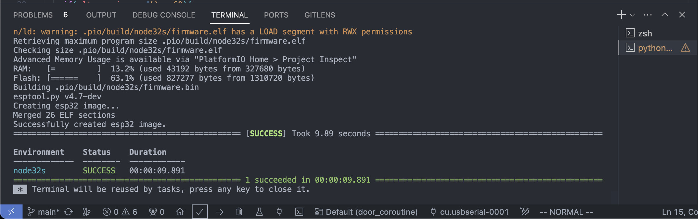
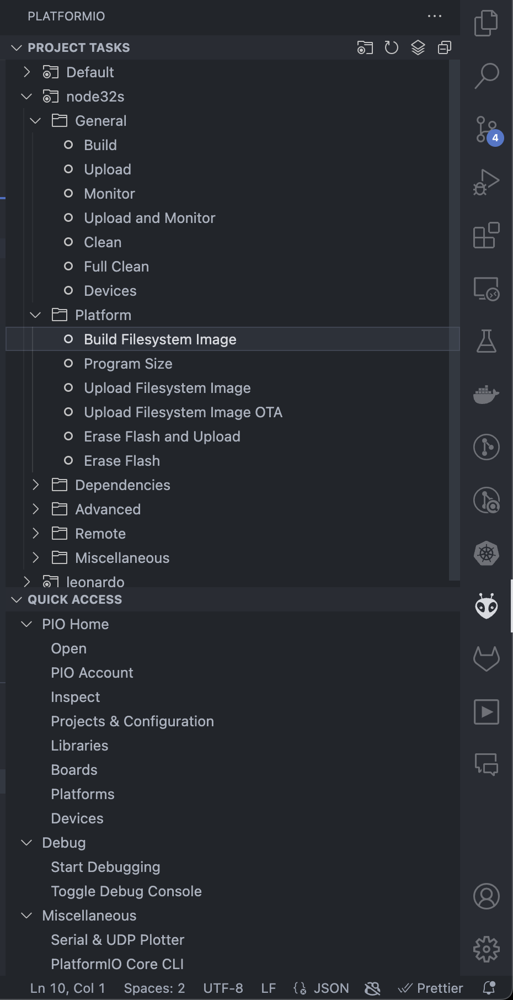

# Access Control Terminal Hardware

## Table Of Contents
- [Prerequisites](#prerequisites)
- [How to Setup](#how-to-setupj)


## Prerequisites
- [Visual Studio Code](https://code.visualstudio.com/)
- [PlatformIO IDE for VSCode](https://marketplace.visualstudio.com/items?itemName=platformio.platformio-ide)


## How to Setup

### Build ชุดโปรแกรม
1. เมื่อติดตั้ง `Visual Studio Code` และ `PlatformIO IDE for VSCode` แล้วนั้น ให้ทดลอง compile ชุดโปรแกรมด้วยปุ่ม `build` () ด้านล่างของโปรแกรม



หากชุดโปรแกรมสามารถ build ได้เรียบร้อย ควรจะเห็นสถานะ `SUCCESS` ขึ้นตามรูปด้านบน

### การตั้งค่า Parameter เบื้องต้น
1. ทำการสร้าง Directory `data` ไว้ที่ Directory นอกสุด
```
mkdir data
cd data
```
2. ทำการสร้างไฟล์ชื่อว่า `config.json` โดยมีเนื้อหาภายในไฟล์ดังนี้

```json
{
  "ssid": "<SSID_NAME>",
  "password": "<PASSWORD_OF_YOUR_WIFI>",
  "local_IP": "192.168.95.99",
  "gateway": "192.168.95.1",
  "subnet": "255.255.255.0"
}
```

โดยรายละเอียดของแต่ละ field มีดังนี้
- `ssid` : คือชื่อของ Wifi ที่ต้องการจะให้อุปกรณ์นัน้เชื่อมต่อ
- `password` : รหัสผ่านสำหรับการเชื่อมต่อ Wifi ที่ต้องการจะให้อุปกรณ์นัน้เชื่อมต่อ

Note: Wifi ที่ต้องการจะเชื่อมต่อนั้น เมื่ออุปกรณีทำการเชื่อมต่อแล้ว จะต้องอยู่ใน network เดียวกันกับ Terminal

- `local_IP` : IP ของอุปกรณ์ โดยจะใช้ในการ setup บน terminal ต่อไป
- `gateway` : IP Gateway ของเครือข่าย
- `subnet` : Subnet ของเครือข่าย

3. เมื่อแก้ไขไฟล์ `config.json` สำเร็จแล้ว ให้ทำการ upload config ดังกล่าวโดยการคลิก PlatformIO Setting > node32s > Build Filesystem Image



4. เมื่อกด `Build Filesystem Image` เรียบร้อยแล้ว ให้กดปุ่ม `Upload Filesystem Image` โดยสถานะของการ Upload ควรขึ้นว่า `SUCCESS`

5. ทำการ Upload ชุดโปรแกรมโดยการกดปุ่ม Upload ด้านล่าง (ข้างปุ่ม Build)


โดยสถานะของการ Upload ควรขึ้นว่า `SUCCESS`


### ทดสอบการทำงาน
โดยหากทำการต่อวงจรครบถ้วนสมบุรณ์แล้ว ให้ทดลอง Join Network ในวงเดียวกันกับอุปกรณ์ แล้วทดลอง Request `GET` method ดังต่อไปนี้ 

```
curl <local_IP>
```

โดย `<local_IP>` คือ IP ที่ได้ตั้งค่าบนไฟล์ `config.json`

หากทุกอย่างถูกต้อง ควรได้ HTTP Response เป็น `200` และประตูปลดล็อกได้